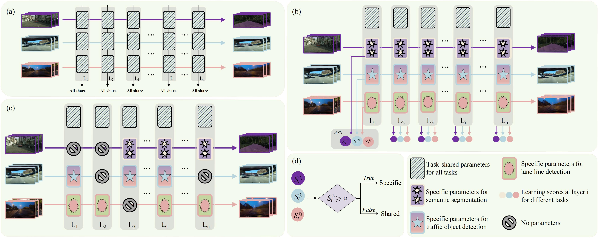
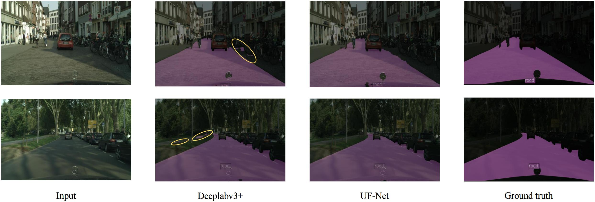
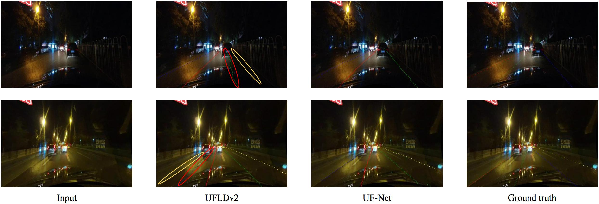
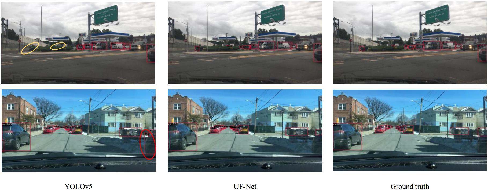

# UF-Net
- `mmyolo`: contains the code for UF-Net's traffic object detection task.
- `mmsegmentation`: contains code for lane line detection and segmentation of the drivable area.
- `YOLOP+GHS+ASS`: code containing the supplementary experimental part of the article.

### The Illustration of UF-Net

The proposed two training stages and inference process, where (a) and (b) introduce the universal feature learning stage and the task-
specific feature learning stage respectively, (c) demonstrates the inference process, and (d) briefly shows the implementation process of adaptive
sharing scheme (ASS).
## Requirement
 `pip install -r requirements.txt`
## Download pre-training weights
1. Download our weights at the following address：`https://pan.baidu.com/s/1XErEnN991n5xBT5vzkbVFQ?pwd=wh6a`
`password：wh6a `

### traffic object detection task of UF-Net 

test：`python mmsegmentation/tools/test.py mmsegmentation/configs/mtl_ad/task_det.py path/to/your/weights`

#### Comparison of mAP50 and Recall between different methods on the BDD100K dataset.

| Network                              | Backbone       | Recall (%) | mAP50 (%) |
| ------------------------------------ | -------------- | ---------- | --------- |
| `Fast R-CNN (Asgarian et al., 2021)` | VGG16          | 81.2       | 64.9      |
| `YOLOv4-5D (Cai et al., 2021)`       | CSPDarknet     | -          | 70.1      |
| `UMT-Auto (Chen et al., 2023)`       | VGG16          | 92.4       | 79.6      |
| `MultiNet (Teichmann et al., 2018)`  | VGG16          | 81.3       | 60.2      |
| `DLT-Net (Teichmann et al., 2018)`   | VGG16          | 89.4       | 68.4      |
| `YOLOP (Wu et al., 2022)`            | CSPDarknet     | 89.2       | 76.5      |
| `HybridNets (Vu et al., 2022)`       | EfficientNet-B3| 92.8       | 77.3      |
| `Miraliev et al. (Miraliev et al., 2023)` | RegNetY    | 86.1       | 77.5      |
| `YOLO v5 (Jocher et al., 2020)`      | ResNet-18      | -          | 75.7      |
| `YOLO v5 (Jocher et al., 2020)`      | CSPDarknet     | 86.8       | 77.2      |
| `UF-Net-T (ours)`                    | ResNet-18      | 92.3       | 79.2      |
| `UF-Net-S (ours)`                    | ResNet-34      | 93.3       | 80.1      |

### drivable area segmentation of UF-Net

test：`python mmsegmentation/tools/test.py mmsegmentation/configs/mtl_ad/task_culane.py path/to/your/weights`

#### Comparison of mIoU between different methods on the Cityscapes dataset.

| Network                            | Backbone      | mIoU (%) |
| ---------------------------------- | ------------- | -------- |
| `ERFNet (Romera et al., 2017)`     | ResNet-34     | 68.7     |
| `UMT-Net (Chen et al., 2023)`      | VGG16         | 68.9     |
| `Deeplab-CRF (Chen et al., 2017a)` | ResNet-101    | 70.4     |
| `MLFNet (Fan et al., 2022)`        | ResNet-34     | 72.1     |
| `PSPNet (Zhao et al., 2017)`       | ResNet-101    | 74.9     |
| `SCNN (Xingang Pan and Tang, 2018)`| VGG16         | 76.4     |
| `Trans4PASS (Zhang et al., 2022)`  | Trans4PASS-T  | 79.1     |
| `Trans4PASS (Zhang et al., 2022)`  | Trans4PASS-T  | 81.1     |
| `SeMask (Jain et al., 2023)`       | SeMask Swin-L | 80.4     |
| `Y-model (Fontinele et al., 2021)` | ResNet-101    | 80.6     |
| `BASeg (Xiao et al., 2023b)`       | ResNet-101    | 81.2     |
| `Deeplabv3+ (Chen et al., 2018)`   | ResNet-18     | 76.9     |
| `UF-Net-T (ours)`                  | ResNet-18     | 79.8     |
| `UF-Net-S (ours)`                  | ResNet-34     | 81.6     |
### lane line detection of UF-Net

test：`python mmsegmentation/tools/test.py mmsegmentation/configs/mtl_ad/task_seg.py path/to/your/weights`

#### F1-measure (%) and runtime analysis (IoU threshold = 0.5) on the CULane test set is performed on the NVIDIA RTX 3090 platform.

| Network                                   | Backbone       | Normal | Crowded | Dazzle | Shadow | Noline | Arrow | Curve | Night | FPS | Total |
| ----------------------------------------- | -------------- | ------ | ------- | ------ | ------ | ------ | ----- | ----- | ----- | --- | ----- |
| `SCNN (Xingang Pan and Tang, 2018)`       | -              | 90.6   | 69.7    | 58.5   | 66.9   | 43.4   | 84.1  | 64.4  | 66.1  | 8   | 71.6  |
| `UFLD (Qin et al., 2020)`                 | ResNet-18      | 87.7   | 66.0    | 58.4   | 62.8   | 40.2   | 81.0  | 57.9  | 62.1  | 323 | 68.4  |
| `UFLD (Qin et al., 2020)`                 | ResNet-34      | 90.7   | 70.2    | 59.5   | 69.3   | 44.4   | 85.7  | 69.5  | 66.7  | 175 | 72.3  |
| `PINet (Ko et al., 2021)`                 | -              | 90.3   | 72.3    | 66.3   | 68.4   | 49.8   | 83.7  | 65.6  | 67.7  | -   | 74.4  |
| `RESA (Zheng et al., 2021)`               | ResNet-34      | 91.9   | 72.4    | 66.5   | 72.0   | 46.3   | 88.1  | 68.4  | 69.8  | 51  | 74.5  |
| `RESA (Zheng et al., 2021)`               | ResNet-50      | 92.1   | 73.1    | 69.2   | 72.8   | 47.7   | 88.3  | 70.3  | 69.9  | 39  | 75.3  |
| `LaneATT (Tabelini et al., 2021)`         | ResNet-18      | 91.2   | 72.7    | 65.8   | 68.0   | 49.1   | 87.8  | 63.8  | 68.6  | 176 | 75.1  |
| `O2SFormer (Zhou and Zhou, 2023)`         | ResNet-18      | 91.9   | 73.9    | 70.4   | 74.8   | 49.8   | 86.0  | 68.7  | 70.7  | 89  | 76.1  |
| `O2SFormer (Zhou and Zhou, 2023)`         | ResNet-34      | 92.5   | 75.3    | 70.9   | 77.7   | 51.0   | 87.6  | 68.1  | 72.9  | 84  | 77.0  |
| `CondLaneNet (Liu et al., 2021)`          | ResNet-18      | 92.9   | 75.8    | 70.7   | 80.0   | 52.4   | 89.4  | 72.4  | 72.2  | 154 | 78.1  |
| `GANnet (Wang et al., 2022)`              | ResNet-18      | 93.2   | 77.2    | 71.2   | 77.9   | 53.4   | 89.6  | 75.9  | 72.8  | 164 | 78.8  |
| `UFLDv2-T (Qin et al., 2022)`             | ResNet-18      | 91.7   | 73.0    | 64.6   | 74.7   | 47.2   | 87.6  | 68.7  | 70.2  | 330 | 74.7  |
| `UFLDv2-S (Qin et al., 2022)`             | ResNet-34      | 92.5   | 74.9    | 65.7   | 75.3   | 47.6   | 87.9  | 70.2  | 70.6  | 165 | 75.9  |
| `UF-Net-T (ours)`                         | ResNet-18      | 91.1   | 79.4    | 60.2   | 82.0   | 54.8   | 81.8  | 63.5  | 75.3  | 248 | 78.1  |
| `UF-Net-S (ours)`                         | ResNet-34      | 91.9   | 81.4    | 70.2   | 82.2   | 56.6   | 87.6  | 71.1  | 73.7  | 176 | 79.5  |
### YOLOP+GHS+ASS

test：`python tools/test.py --weights path/to/your/weights`

### Quantitative comparison of UF-Net and baseline models
#### Comparison of drivable area segmentation

#### Comparison of lane line detection

#### Comparison of traffic object detection

