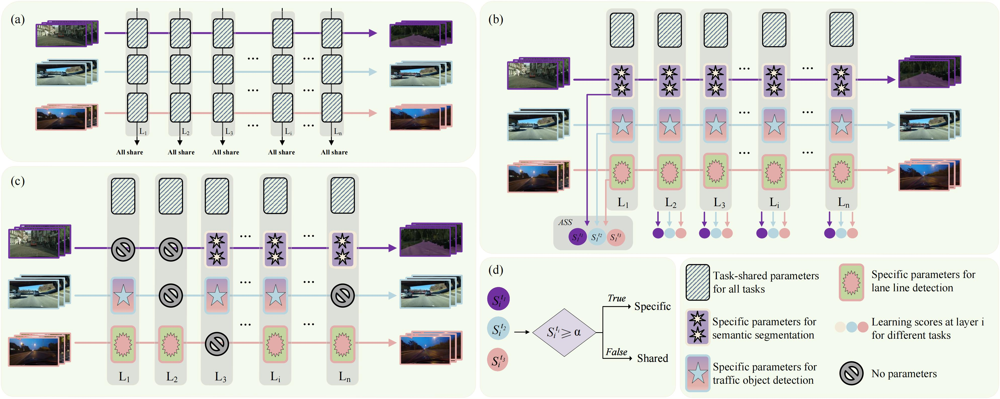
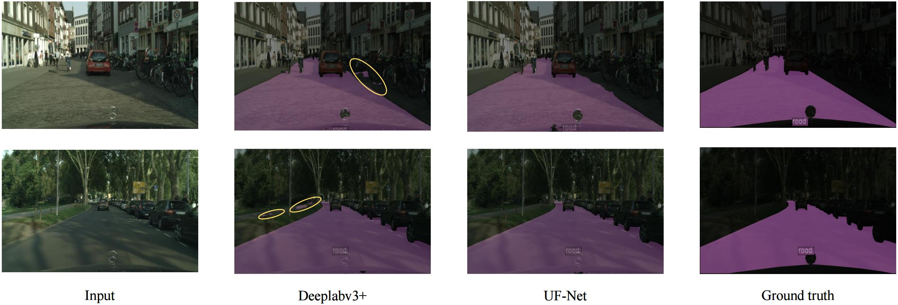
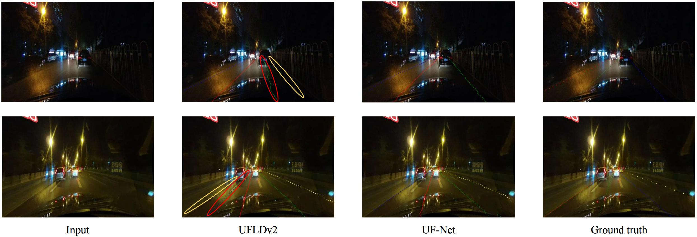
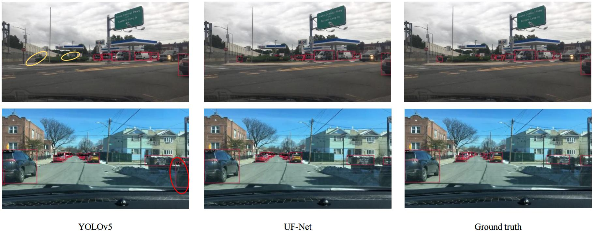

# UF-Net

UF-Net: A Unified Network for Panoptic Driving Perception With Two-Stage Feature Refinement

This repository releases **inference / evaluation** code and configs. Training scripts and training-only configs are not included.

## Layout

- `mmsegmentation/`: UF-Net inference code and test configs (`configs/mtl_ad/`)
- `YOLOP+GHS+ASS/`: supplementary multi-task inference (`tools/test.py`, `tools/demo.py`)
- `readme_pic/`: figures

Install OpenMMLab runtime deps separately (`mmcv`, `mmdet`, `mmyolo`) matching your PyTorch/CUDA, then:

```bash
pip install -r mmsegmentation/requirements.txt
cd mmsegmentation && pip install -e .
```

## Weights

Download pretrained weights:  
`https://pan.baidu.com/s/1XErEnN991n5xBT5vzkbVFQ?pwd=wh6a` (password: `wh6a`)

Before running MMSeg tests, point dataset paths in the configs (or use `--cfg-options`) to your local data.

### Illustration



## Inference (UF-Net)

Run from the repository root. Replace `path/to/your/weights.pth` with your checkpoint.

**Traffic object detection**

```bash
python mmsegmentation/tools/test.py mmsegmentation/configs/mtl_ad/task_det.py path/to/your/weights.pth
```

**Drivable area segmentation**

```bash
python mmsegmentation/tools/test.py mmsegmentation/configs/mtl_ad/task_seg.py path/to/your/weights.pth
```

**Lane line detection**

```bash
python mmsegmentation/tools/test.py mmsegmentation/configs/mtl_ad/task_culane.py path/to/your/weights.pth
```

## Inference (YOLOP+GHS+ASS)

```bash
cd YOLOP+GHS+ASS
python tools/test.py --weights path/to/your/weights.pth
# or single-image / video demo:
python tools/demo.py --weights path/to/your/weights.pth --source path/to/image_or_video
```

## Results

#### Traffic object detection (BDD100K)

| Network | Backbone | Recall (%) | mAP50 (%) |
| --- | --- | --- | --- |
| Fast R-CNN (Asgarian et al., 2021) | VGG16 | 81.2 | 64.9 |
| YOLOv4-5D (Cai et al., 2021) | CSPDarknet | - | 70.1 |
| UMT-Auto (Chen et al., 2023) | VGG16 | 92.4 | 79.6 |
| MultiNet (Teichmann et al., 2018) | VGG16 | 81.3 | 60.2 |
| DLT-Net (Teichmann et al., 2018) | VGG16 | 89.4 | 68.4 |
| YOLOP (Wu et al., 2022) | CSPDarknet | 89.2 | 76.5 |
| HybridNets (Vu et al., 2022) | EfficientNet-B3 | 92.8 | 77.3 |
| Miraliev et al. (2023) | RegNetY | 86.1 | 77.5 |
| YOLO v5 (Jocher et al., 2020) | ResNet-18 | - | 75.7 |
| YOLO v5 (Jocher et al., 2020) | CSPDarknet | 86.8 | 77.2 |
| UF-Net-T (ours) | ResNet-18 | 92.3 | 79.2 |
| UF-Net-S (ours) | ResNet-34 | 93.3 | 80.1 |

#### Drivable area segmentation (Cityscapes)

| Network | Backbone | mIoU (%) |
| --- | --- | --- |
| ERFNet (Romera et al., 2017) | ResNet-34 | 68.7 |
| UMT-Net (Chen et al., 2023) | VGG16 | 68.9 |
| Deeplab-CRF (Chen et al., 2017a) | ResNet-101 | 70.4 |
| MLFNet (Fan et al., 2022) | ResNet-34 | 72.1 |
| PSPNet (Zhao et al., 2017) | ResNet-101 | 74.9 |
| SCNN (Xingang Pan and Tang, 2018) | VGG16 | 76.4 |
| Trans4PASS (Zhang et al., 2022) | Trans4PASS-T | 79.1 |
| Trans4PASS (Zhang et al., 2022) | Trans4PASS-T | 81.1 |
| SeMask (Jain et al., 2023) | SeMask Swin-L | 80.4 |
| Y-model (Fontinele et al., 2021) | ResNet-101 | 80.6 |
| BASeg (Xiao et al., 2023b) | ResNet-101 | 81.2 |
| Deeplabv3+ (Chen et al., 2018) | ResNet-18 | 76.9 |
| UF-Net-T (ours) | ResNet-18 | 79.8 |
| UF-Net-S (ours) | ResNet-34 | 81.6 |

#### Lane detection (CULane, IoU=0.5, RTX 3090)

| Network | Backbone | Normal | Crowded | Dazzle | Shadow | Noline | Arrow | Curve | Night | FPS | Total |
| --- | --- | --- | --- | --- | --- | --- | --- | --- | --- | --- | --- |
| SCNN (2018) | - | 90.6 | 69.7 | 58.5 | 66.9 | 43.4 | 84.1 | 64.4 | 66.1 | 8 | 71.6 |
| UFLD (2020) | ResNet-18 | 87.7 | 66.0 | 58.4 | 62.8 | 40.2 | 81.0 | 57.9 | 62.1 | 323 | 68.4 |
| UFLD (2020) | ResNet-34 | 90.7 | 70.2 | 59.5 | 69.3 | 44.4 | 85.7 | 69.5 | 66.7 | 175 | 72.3 |
| PINet (2021) | - | 90.3 | 72.3 | 66.3 | 68.4 | 49.8 | 83.7 | 65.6 | 67.7 | - | 74.4 |
| RESA (2021) | ResNet-34 | 91.9 | 72.4 | 66.5 | 72.0 | 46.3 | 88.1 | 68.4 | 69.8 | 51 | 74.5 |
| RESA (2021) | ResNet-50 | 92.1 | 73.1 | 69.2 | 72.8 | 47.7 | 88.3 | 70.3 | 69.9 | 39 | 75.3 |
| LaneATT (2021) | ResNet-18 | 91.2 | 72.7 | 65.8 | 68.0 | 49.1 | 87.8 | 63.8 | 68.6 | 176 | 75.1 |
| O2SFormer (2023) | ResNet-18 | 91.9 | 73.9 | 70.4 | 74.8 | 49.8 | 86.0 | 68.7 | 70.7 | 89 | 76.1 |
| O2SFormer (2023) | ResNet-34 | 92.5 | 75.3 | 70.9 | 77.7 | 51.0 | 87.6 | 68.1 | 72.9 | 84 | 77.0 |
| CondLaneNet (2021) | ResNet-18 | 92.9 | 75.8 | 70.7 | 80.0 | 52.4 | 89.4 | 72.4 | 72.2 | 154 | 78.1 |
| GANnet (2022) | ResNet-18 | 93.2 | 77.2 | 71.2 | 77.9 | 53.4 | 89.6 | 75.9 | 72.8 | 164 | 78.8 |
| UFLDv2-T (2022) | ResNet-18 | 91.7 | 73.0 | 64.6 | 74.7 | 47.2 | 87.6 | 68.7 | 70.2 | 330 | 74.7 |
| UFLDv2-S (2022) | ResNet-34 | 92.5 | 74.9 | 65.7 | 75.3 | 47.6 | 87.9 | 70.2 | 70.6 | 165 | 75.9 |
| UF-Net-T (ours) | ResNet-18 | 91.1 | 79.4 | 60.2 | 82.0 | 54.8 | 81.8 | 63.5 | 75.3 | 248 | 78.1 |
| UF-Net-S (ours) | ResNet-34 | 91.9 | 81.4 | 70.2 | 82.2 | 56.6 | 87.6 | 71.1 | 73.7 | 176 | 79.5 |

#### YOLOP+GHS+ASS (BDD100K)

| Model | Drivable mIoU (%) | Det mAP50 (%) | Lane IoU (%) | Params | M-Score | FPS |
| --- | --- | --- | --- | --- | --- | --- |
| YOLOP (Wu et al., 2022) | 91.5 | 76.5 | 26.2 | 8.25M | 194.2 | 42.0 |
| Ours (YOLOP+GHS) | 92.5 | 83.6 | 27.5 | 8.25M | 203.6 | 43.7 |
| Ours (YOLOP+GHS+ASS) | 92.6 | 84.6 | 31.1 | 13.36M | 208.3 | 42.9 |

### Qualitative comparison

#### Drivable area


#### Lane line


#### Traffic object

