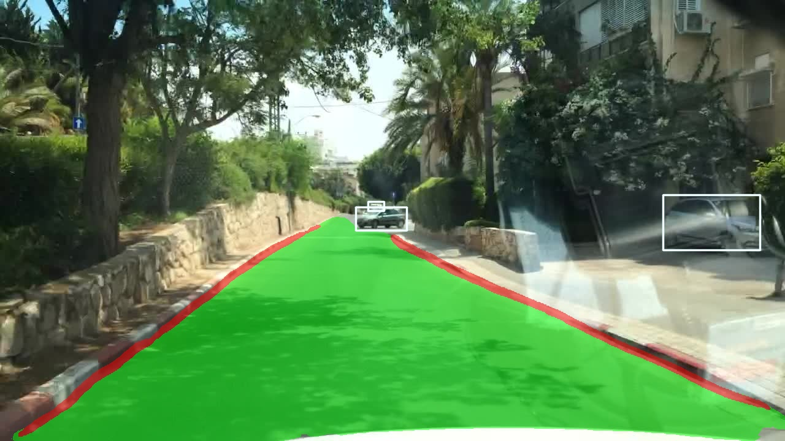
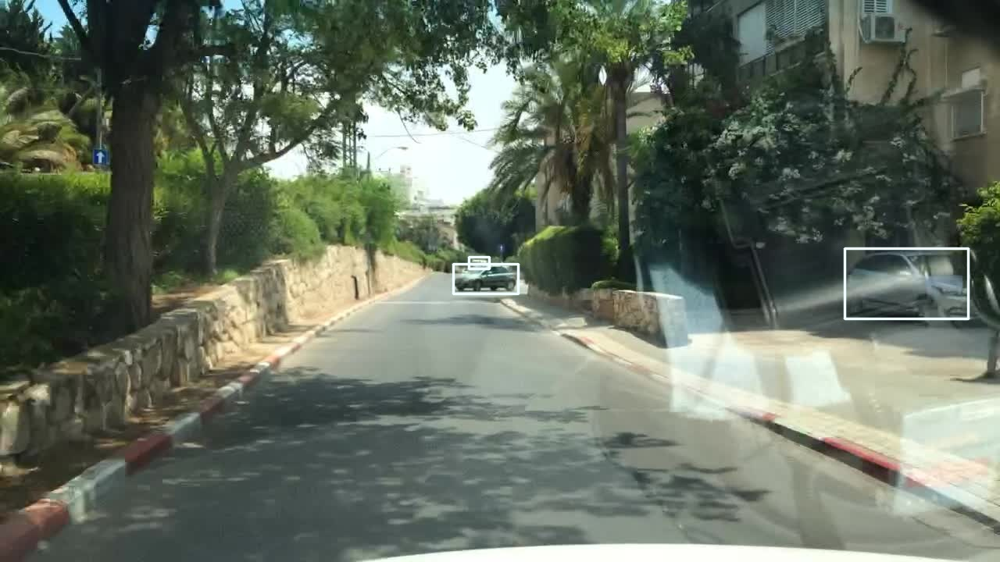
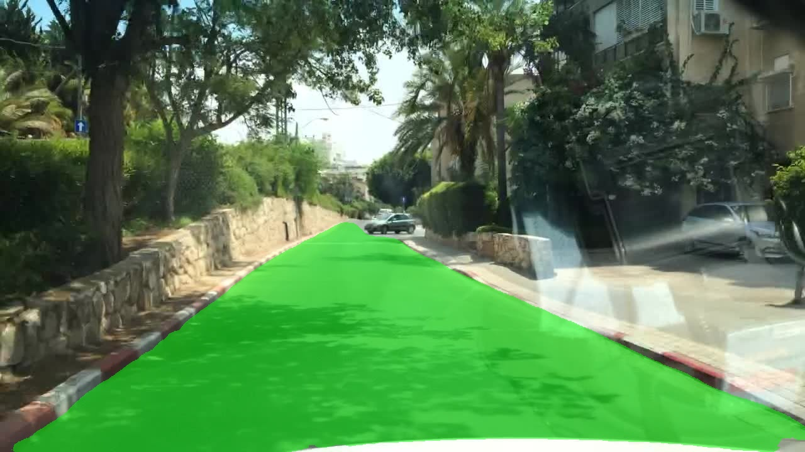
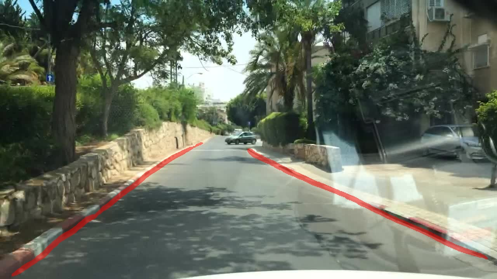

<div align="left">   

## YOLOP+GHS+ASS


### Contributions

* 

* 
  
* 

### Results

Comparison with the multi-task model on the BDD100K dataset

| Model                              | Drivable area mIoU (%) | Object detection mAP50 (%) | Lane detection IoU (%) | Number of parameters | M-Score | Speed (FPS) |
| ---------------------------------- | ---------------------- | ------------------------- | --------------------- | ------------------- | ------- | ----------- |
| MultiNet (Teichmann et al., 2018)  | 71.6                   | 60.2                      | -                     | 35.6M                | -       | 12.6        |
| DLT-Net (Teichmann et al., 2018)   | 72.1                   | 68.4                      | -                     | -                    | -       | 9.3         |
| YOLOPv2 (Han et al., 2022)         | 93.2                   | 83.2                      | 27.2                  | 38.9M                | 203.6   | 34.7        |
| HybridNets (Vu et al., 2022)       | 90.5                   | 77.3                      | 31.6                  | 12.8M                | 199.4   | 36.0        |
| VGG16-BiFPN (Abdiqapparov et al., 2022) | 76.1               | 70.1                      | 20.4                  | 17.7M                | 166.6   | 38.0        |
| YOLO-ODL (Guo et al., 2023)        | 92.3                   | 79.7                      | 27.5                  | 17.7M                | 199.5   | 94.7        |
| Miraliev et al. (Miraliev et al., 2023) | 91.9                 | 77.5                      | 33.8                  | 6.52M                | 200.3   | 46.9        |
| Hybrid CNN+PVT (Usman et al., 2024) | 93.1                  | 79.2                      | 27.8                  | 8.13M                | 200.0   | 7.25        |
| A-YOLOM (Wang et al., 2024)        | 91.0                   | 81.1                      | 28.8                  | 13.61M               | 200.9   | 39.7        |
| YOLOP (Wu et al., 2022)            | 91.5                   | 76.5                      | 26.2                  | 8.25M                | 194.2   | 42.0        |
| Ours (YOLOP+GHS)                   | 92.5                   | 83.6                      | 27.5                  | 8.25M                | 203.6   | 43.7        |
| Ours (YOLOP+GHS+ASS)               | 92.6                   | 84.6                      | 31.1                  | 13.36M               | 208.3   | 42.9        |

#### Traffic Object Detection Result

| Model          | Recall(%) | mAP50(%) | Speed(fps) |
| -------------- | --------- | -------- | ---------- |
| `Multinet`     | 81.3      | 60.2     | 8.6        |
| `DLT-Net`      | 89.4      | 68.4     | 9.3        |
| `Faster R-CNN` | 81.2      | 64.9     | 8.8        |
| `YOLOv5s`      | 86.8      | 77.2     | 82         |
| `YOLOP`        | 89.2      | 76.5     | 41         |
| `YOLOP+GHS`    | 91.7      | 83.6     | 43.7       |
| `YOLOP+GHS+ASS`| -         | 84.6     | 42.9       |
#### Drivable Area Segmentation Result

| Model         | mIOU(%) | Speed(fps) |
| ------------- | ------- | ---------- |
| `Multinet`    | 71.6    | 8.6        |
| `DLT-Net`     | 71.3    | 9.3        |
| `PSPNet`      | 89.6    | 11.1       |
| `YOLOP`       | 91.5    | 41         |
| `YOLOP+GHS`   | 92.5    | 43.7       |
| `YOLOP+GHS+ASS`| 92.6     | 42.9       |
#### Lane Detection Result:

| Model         |  IOU(%) |
| ------------- |  ------ |
| `ENet`        |  14.64  |
| `SCNN`        |  15.84  |
| `ENet-SAD`    |  16.02  |
| `YOLOP`       |  26.20  |
| `YOLOP+GHS`   |   27.5  |
| `YOLOP+GHS+ASS`   |   31.1  |

### Visualization

#### Panoptic



#### Traffic Object Detection Result



#### Drivable Area Segmentation Result



#### Lane Detection Result



**Notes**: 

- 

---

---

### Requirement

This codebase has been developed with python version 3.7, PyTorch 1.7+ and torchvision 0.8+:

```
conda install pytorch==1.7.0 torchvision==0.8.0 cudatoolkit=10.2 -c pytorch
```

See `requirements.txt` for additional dependencies and version requirements.

```setup
pip install -r requirements.txt
```

### Data preparation

#### Download

- Download the images from [images](https://bdd-data.berkeley.edu/).

- Download the annotations of detection from [det_annotations](https://drive.google.com/file/d/1Ge-R8NTxG1eqd4zbryFo-1Uonuh0Nxyl/view?usp=sharing). 
- Download the annotations of drivable area segmentation from [da_seg_annotations](https://drive.google.com/file/d/1xy_DhUZRHR8yrZG3OwTQAHhYTnXn7URv/view?usp=sharing). 
- Download the annotations of lane line segmentation from [ll_seg_annotations](https://drive.google.com/file/d/1lDNTPIQj_YLNZVkksKM25CvCHuquJ8AP/view?usp=sharing). 

We recommend the dataset directory structure to be the following:

```
# The id represent the correspondence relation
├─dataset root
│ ├─images
│ │ ├─train
│ │ ├─val
│ ├─det_annotations
│ │ ├─train
│ │ ├─val
│ ├─da_seg_annotations
│ │ ├─train
│ │ ├─val
│ ├─ll_seg_annotations
│ │ ├─train
│ │ ├─val
```

Update the your dataset path in the `./lib/config/default.py`.


### Evaluation

You can set the evaluation configuration in the `./lib/config/default.py`. (Including： batch_size and threshold value for nms).

Start evaluating:

```shell
python tools/test.py --weights weights/End-to-end.pth
```


#### Folder

You can store the image or video in `--source`, and then save the reasoning result to `--save-dir`

```shell
python tools/demo.py --source inference/images
```


#### Camera

If there are any camera connected to your computer, you can set the `source` as the camera number(The default is 0).

```shell
python tools/demo.py --source 0
```


